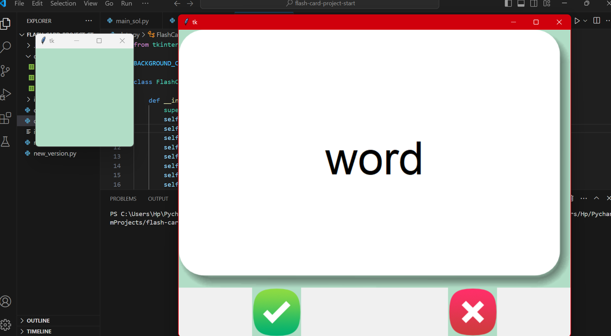

# 🧠 Flashcard Language Learning Tool

A simple tool to **learn the most commonly used words** in a new language — made with Python & `tkinter`.

---

## 📚 Project Purpose

This was a task from the **Angela Yu Python Bootcamp** on Udemy.  
I tried building it **on my own first**, made it halfway, then **followed along with Angela** to fix my mistakes and complete the rest.

---

## 🌍 Features

- Choose from **5 languages**:  
  🇫🇷 French | 🇪🇸 Spanish | 🇮🇹 Italian | 🇬🇧 English | 🇮🇳 Hindi

- Flip flashcards to test your vocabulary  
- Tracks your mistakes automatically  
- Saves all words to learn in your selected language into a CSV file called `words_to_learn.csv`  
- If you guess a word correctly, it’s removed from `words_to_learn.csv` — so you focus only on what you need!

---

## 🧠 Smart Learning

This tool helps you **focus on what you haven’t learned yet**:  
✔️ Known word → removed  
❌ Missed word → stays in `to_learn.csv`  
Every time you run the app, it loads from this saved progress!

---

## 🖼 Screenshot

